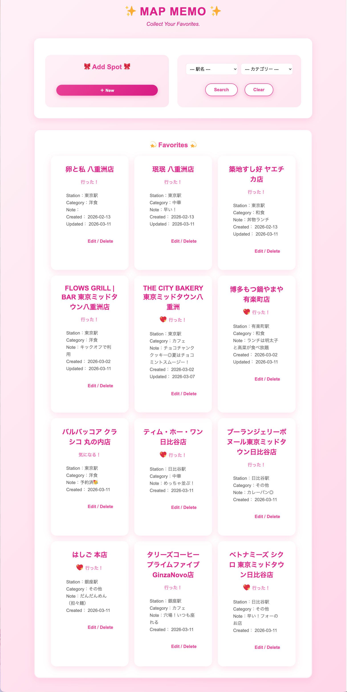
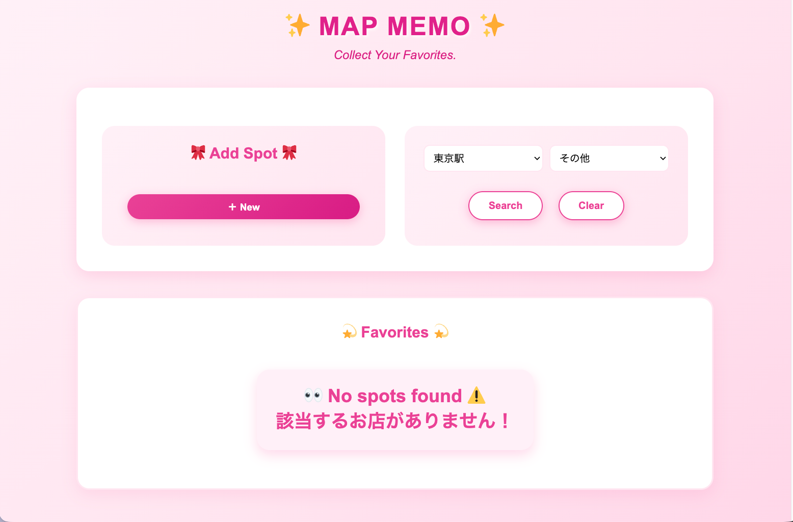
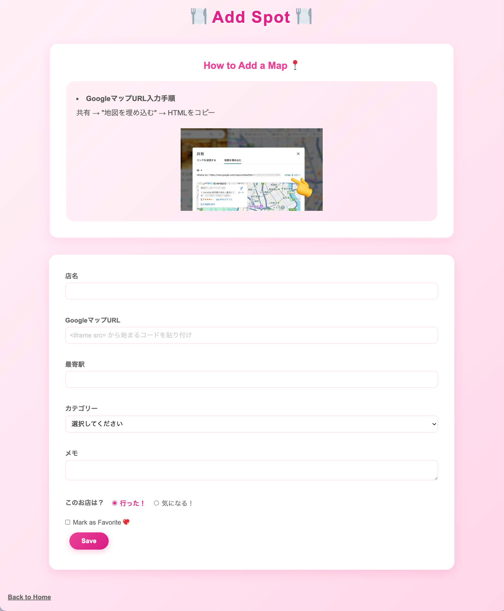
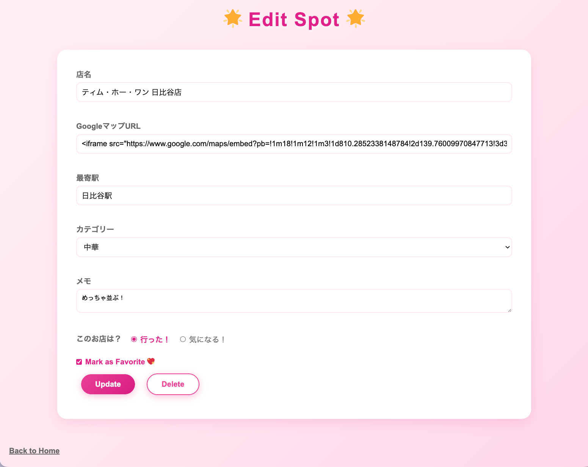
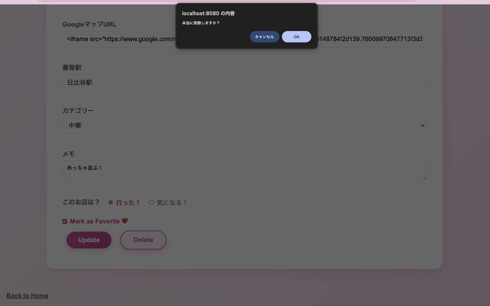

# 🗺️ Map Memo App

職業訓練校の卒業制作として開発した、自分が行ったお店や、これから行きたいお店を登録・管理できる、自分だけのグルメマップアプリです。

---

## 📖 概要・目的

「今日なに食べる？」「この辺でいいお店ある？」そんな場面でサッと答えられるよう、行ったお店や気になるお店を記録しておけるアプリを目指して開発しました。

Googleマップと連携することで、登録したお店の場所を地図で確認したり、ナビや口コミへのアクセスも簡単に行えます。

なお、デザインのアイデアや画面構成は自分で考え、コードの実装・デバッグ・コメント整備の場面でAIアシスタントをツールとして活用しました。
AIを正しく使いながら自分で考えて開発することも、これからのエンジニアに必要なスキルだと考えています。

---

## 🖼️ スクリーンショット

### TOP画面（一覧）


### 検索画面（絞り込み結果なし）


### 登録画面


### 編集画面


### 削除確認ダイアログ


---

## ✨ 機能一覧

| 機能 | 説明 |
|------|------|
| 店舗登録 | 店名・最寄り駅・カテゴリー・GoogleマップURLなどを登録 |
| 一覧表示 | 登録した店舗をカード形式で一覧表示 |
| 検索 | 駅名・カテゴリーで絞り込み検索 |
| お気に入り | お気に入りの店舗にハートマークを表示 |
| 編集・更新 | 登録済みの情報を編集・更新 |
| 削除 | 確認ダイアログ付きで店舗情報を削除 |
| マップ表示 | GoogleマップのiframeコードをそのままJSPで展開して地図を表示 |

---

## 🛠️ 使用技術

| カテゴリ | 技術 |
|----------|------|
| サーバーサイド | Java / Servlet / JSP / JSTL |
| データベース | MySQL |
| フロントエンド | HTML / CSS / JavaScript |
| Webサーバー | Apache Tomcat |
| 開発環境 | Eclipse |
| ライブラリ | Twemoji（絵文字の統一表示） |

---

## 📁 ディレクトリ構成

```
map-memo-app/
├── src/
│   ├── servlet/        # Servlet（Controller）
│   │   ├── AddServlet.java
│   │   ├── DeleteServlet.java
│   │   ├── EditServlet.java
│   │   ├── ListServlet.java
│   │   └── MapServlet.java
│   ├── dao/            # DB接続・CRUD処理（Model）
│   │   ├── DBConnection.java
│   │   └── RestaurantDao.java
│   └── dto/            # データ格納クラス（Model）
│       └── Restaurant.java
├── WebContent/
│   ├── add.jsp
│   ├── edit.jsp
│   ├── list.jsp
│   ├── map.jsp
│   ├── css/
│   │   └── style.css
│   ├── js/
│   │   └── script.js
│   └── img/
├── slide/              # 卒業制作発表スライド
│   ├── slide.html
│   └── img/
└── README.md
```

---

## ⚙️ セットアップ

### 必要な環境
- Java 11以上
- Apache Tomcat 8
- MySQL 8.0以上
- Eclipse（Dynamic Web Project）

### 手順

**1. リポジトリをクローン**
```bash
git clone https://github.com/your-username/map-memo-app.git
```

**2. データベースを作成**
```sql
CREATE DATABASE mapmemo_app CHARACTER SET utf8mb4;
```

**3. テーブルを作成**
```sql
CREATE TABLE restaurants (
  id INT NOT NULL AUTO_INCREMENT,
  name VARCHAR(100) NOT NULL,
  map_url TEXT NOT NULL,
  station VARCHAR(50) NOT NULL,
  visit BOOLEAN DEFAULT NULL,
  memo VARCHAR(200) DEFAULT NULL,
  good BOOLEAN DEFAULT NULL,
  category VARCHAR(50) NOT NULL,
  created_at DATETIME DEFAULT CURRENT_TIMESTAMP,
  updated_at DATETIME DEFAULT CURRENT_TIMESTAMP ON UPDATE CURRENT_TIMESTAMP,
  PRIMARY KEY (id)
);
```

**4. DB接続情報を変更**

`src/dao/DBConnection.java` のパスワードをご自身の環境に合わせて変更してください。

```java
Connection con = DriverManager.getConnection(
    "jdbc:mysql://localhost:3306/mapmemo_app?useUnicode=true&characterEncoding=UTF-8",
    "root", // ← ここも必要に応じて変更
    "your_password" // ← ここを変更
);
```

**5. EclipseでTomcatを起動してアクセス**
```
http://localhost:8080/MapMemoApp/list
```

---

## 📝 備考

- GoogleマップのURLは「共有 → 地図を埋め込む → HTMLをコピー」で取得できます
- 本アプリは職業訓練校の卒業制作として開発しました
